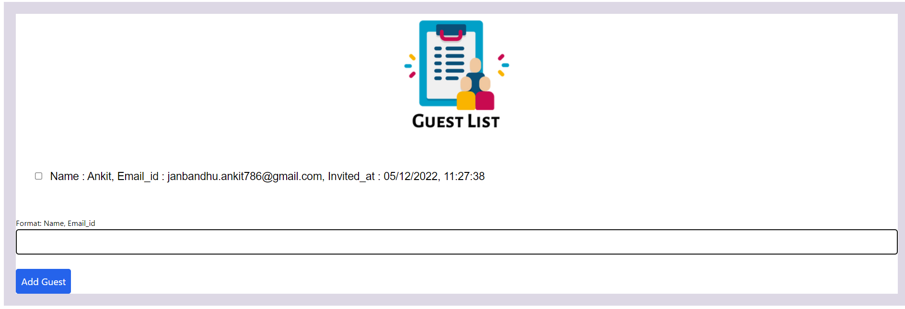
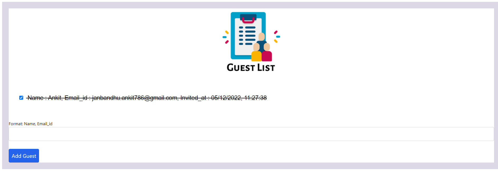

# Guest List using Pyscript

This is the Basic project i have build on pyscript to test it and getting familier with it
more advanced projects on the way stay tuned

## Installation

Install my-project with gitbash

```bash
git clone https://github.com/pompy001/Pyscript_GuestList.git
```
To save directory name as your custom name an additional argument is to be passed for your custom name of directory

```bash
git clone https://github.com/pompy001/Pyscript_GuestList.git custom_name
```   
## Screenshots

when you Run it. it will look like this


Just type **name,Email_id** and press enter



Just Check the **box** if person attends the event



## License

[MIT](https://choosealicense.com/licenses/mit/)

